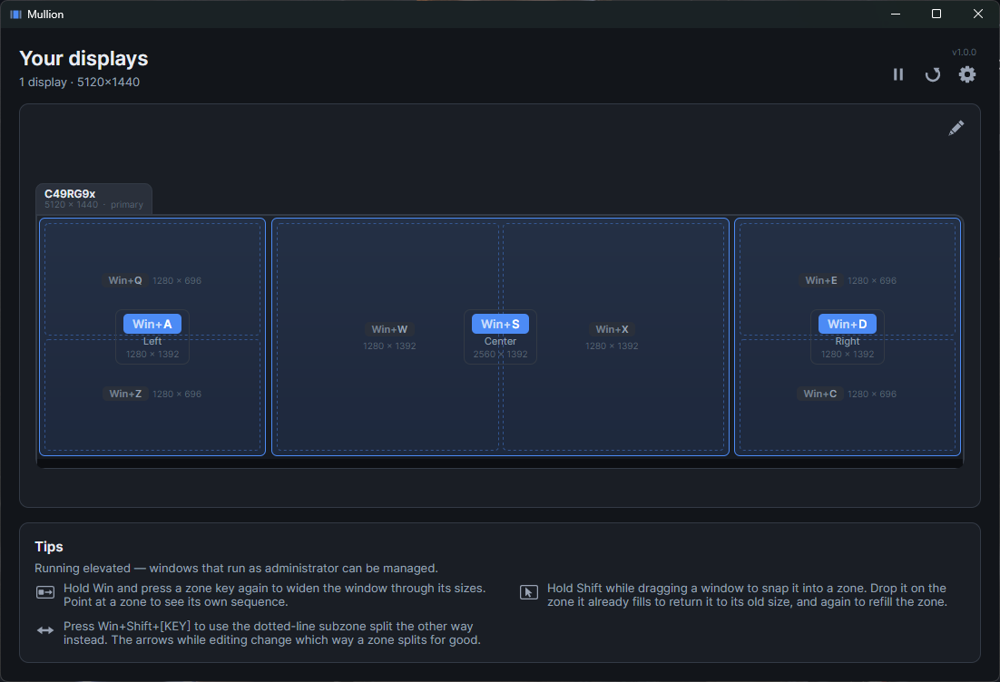
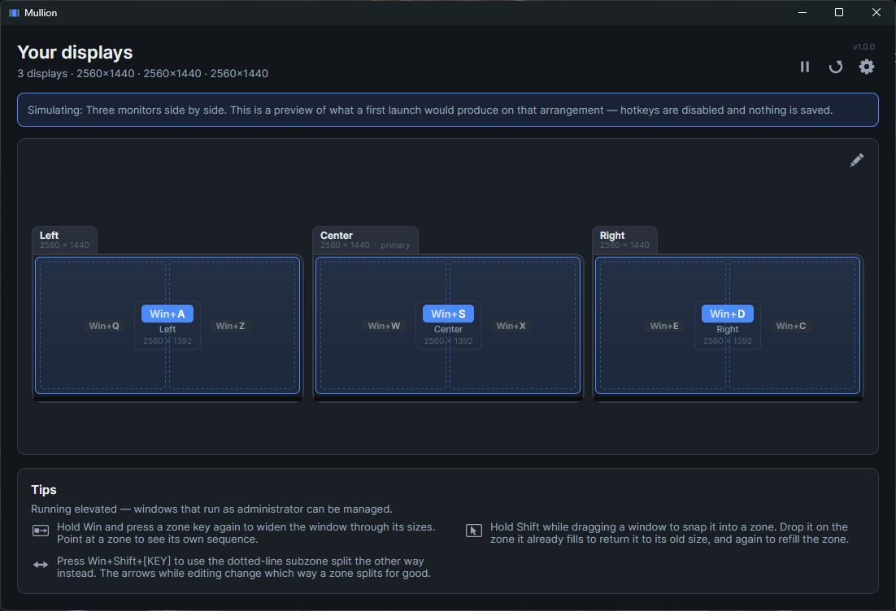
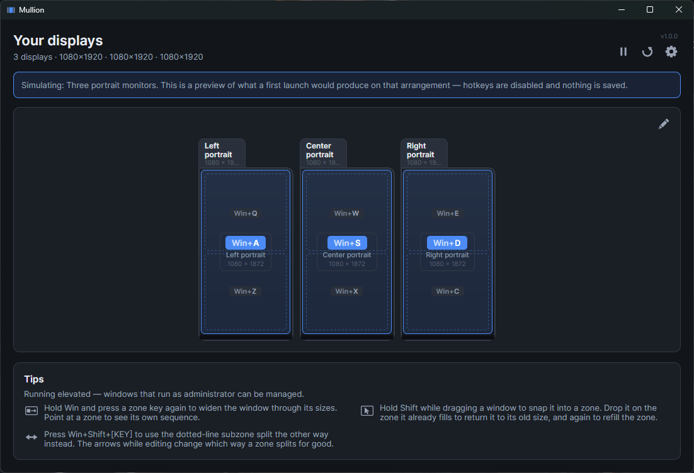
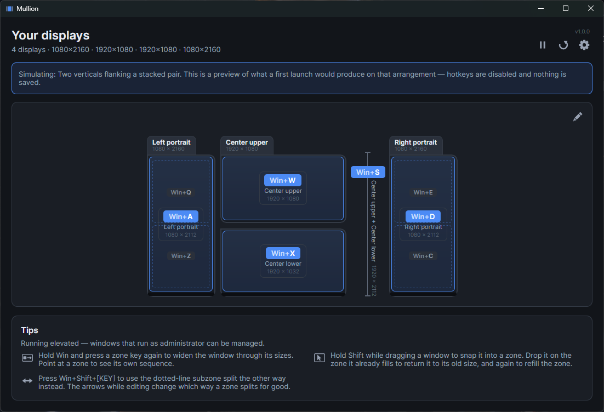
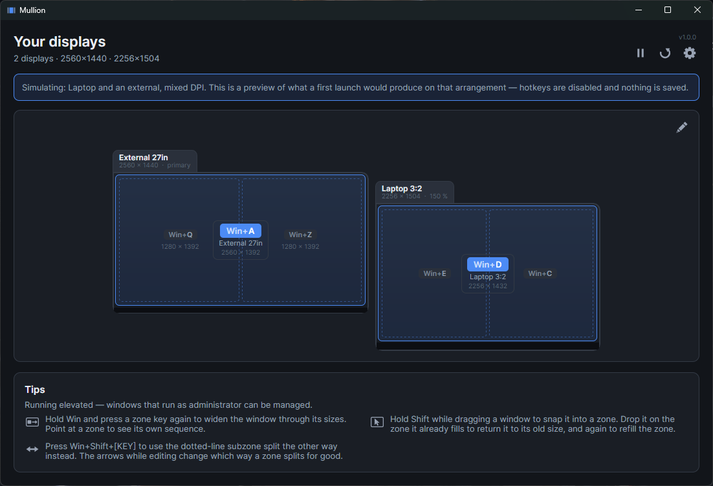
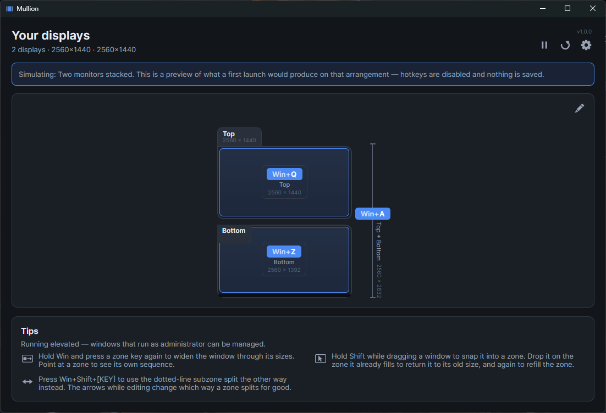

# Mullion

**Press `Win` and a key, and the window you are looking at snaps to a zone.**

A free, one-file window tiler for Windows. It reads your actual monitor
arrangement, works out a split that suits each screen's shape, and lays the
zones onto the left-hand keys so the keyboard becomes a small map of your desk.
Nothing to configure before it works.

[](https://github.com/levinium/Mullion/releases/latest)
[](https://github.com/levinium/Mullion/releases)

[](https://github.com/levinium/Mullion/actions/workflows/ci.yml)
[](https://github.com/sponsors/levinium)



## Download

**[Download Mullion.exe](https://github.com/levinium/Mullion/releases/latest)** (64 MB)

Put it anywhere and run it. That is the whole installation — there is nothing to
unzip, no setup step and no registry entry, because the .NET runtime it needs is
inside the file. Delete it and it is gone. You need 64-bit Windows and nothing
else.

Then turn on **Start Mullion when I sign in** in Settings. Auto-start remembers
wherever the file is at that moment, so put it where you want it first.

Windows SmartScreen will warn that the app is unsigned. Choose **More info**,
then **Run anyway** — or read the source and build it yourself. Some antivirus
engines flag it on sight too, because a keyboard hook inside a single file has
the same shape as a packed keylogger. What separates the two is what the hook
does with a keystroke, and this one never records them: only the *name* of a
chord that matched is ever written down.

[SECURITY.md](SECURITY.md) sets out exactly why the hook is needed, what is
never recorded, and what does and does not leave your machine. Every release
publishes a SHA256 beside the download so you can check you got the file the
build produced.

## Why it exists

Windows gives you `Win`+arrow and nothing else. The good tools that go further —
DisplayFusion and the like — want paying, and the free one everybody reaches for
cannot bind the keys you actually want: `RegisterHotKey` is refused
`Win`+letter, because the shell has already claimed those. The usual advice is to
remap the Windows key with PowerToys first, which is a workaround that leaks into
every other app you use.

Mullion takes those keys directly, with no remap in the chain and nothing else to
install.

## The keyboard is a map of your desk

The left-hand keys are already a grid, so your monitors are mapped onto them
position for position:

```
   Q  W  E        the upper part of each screen
   A  S  D        the whole of each screen      <- home row
   Z  X  C        the lower part of each screen
```

Three monitors, nine zones, nothing to learn beyond left-middle-right:



Two things make this stay comfortable. **The home row always means "the whole of
this screen"** — whatever else changes, `A`/`S`/`D` addresses the monitors
themselves, so the rows above and below only ever add to what you already know.
And **nothing is hardcoded per monitor type**: the splits come from each screen's
proportions, so an ultrawide, a 3:2 laptop or a monitor turned on its side all
get something sensible without having been anticipated.

## Zones that suit the screen they are on

A wide screen splits into side-by-side halves, because that is what a wide screen
is good for. A tall one stacks them:



Hold **Shift** to get the other orientation for a single press — `Win+Shift+Q`
takes the half that `Win+Q` did not. The dotted line on the diagram shows you
which half that is, so you never have to remember. To change it for good, open
the zone editor and use the arrows in a zone's corner.

## Press again to grow

Tap a key again **while still holding Win** and the window widens through a
cycle — its zone, then the half of the screen it sits in, then the whole screen.
Let go of Win and it starts over, so an extra press now cannot surprise you ten
minutes later.

```
Win held, A tapped 3x    1280 -> 2560 -> 5120 wide
Win released between     1280 every time
```

## Or just drag

Hold **Shift** while dragging a window and the zones appear; the one under your
cursor lights up; let go and the window lands in it. If you would rather not hold
anything, set the modifier to none and the zones come up on every drag.

Windows that draw their own title bars — Chrome, VS Code, Slack, anything
Electron — work the same as any other.

## Desks that other tools give up on

Most window tilers assume a row of identical monitors. Mullion works out the
arrangement from what is actually plugged in, so the awkward ones are just
another shape.

Two vertical monitors flanking a stacked pair — every column spends its own keys,
so nine zones land on nine keys and nothing sits idle:



A laptop docked to a bigger screen at a different scaling:



Two monitors stacked, where `Win+S` spans both because they line up exactly:



Unplug something, change a resolution, dock or undock, and the zones follow. They
are stored as proportions rather than pixels, so they survive the change instead
of needing to be set up again.

## Other keys

| Key | What it does |
|---|---|
| `Win+` `` ` `` | Minimize the window |
| `Win+Backspace` | Undo the last move — including bringing back a minimized window, focused |

Both are just defaults. Rebind them in Settings, or clear them, and bind zones to
whatever keys you like — the fifteen the layout starts from are a starting point,
not a limit.

## It keeps itself up to date

Once a day Mullion asks GitHub whether a newer version exists and says so on the
main window if one does. **Settings → About → Download update** fetches it and
**Restart to finish** puts it in place. Two clicks, and nothing happens without
them — no silent updates, and no moment where the app decides on its own to
disappear and come back.

The check sends nothing: no identifier, no machine, nothing about you. It is a
request for a public file, and the answer is compared on your own machine. That
is the only time Mullion uses the network unless you ask it to install something,
so turning the setting off makes the app completely silent.

Before anything is replaced, the download has to match the checksum published
beside it, or it is thrown away and nothing changes. Be clear about what that
does and does not buy, though: the checksum is published from the same place as
the download, so it proves the file arrived intact, not that the release is
trustworthy. Signing the app is what would prove that, and it is not signed yet.

## Good to know

- **Windows that run as administrator.** Windows hides keystrokes from ordinary
  programs while an admin window has focus, so hotkeys do nothing there and such
  windows cannot be moved. Turn on **Start as administrator** in Settings if you
  need to manage them — it registers a scheduled task, so there is no prompt at
  each sign-in.
- **PowerToys FancyZones does the same drag.** Two zone managers fighting over one
  drag gives a different result every time. Mullion notices and tells you, with a
  button to open PowerToys.
- **The tray icon starts hidden.** Windows 11 tucks new tray icons into the
  overflow arrow. Drag it down onto the taskbar to keep it there.
- **Windows only, for now.** macOS and Linux are not built. Linux would be X11
  only in any case, because Wayland does not allow an app to position windows at
  all.

## Supporting it

Mullion is free and always will be. If it saves you the price of a licence for
something else and you would like to say thanks, there is a
[sponsor page](https://github.com/sponsors/levinium) — entirely optional, and the
app is exactly the same either way.

---

## Building from source

Requires the .NET 10 SDK (pinned in `global.json`).

```
dotnet build
dotnet test
dotnet run --project src/Mullion.App
```

To produce the single-file executable:

```
.\tools\Publish.ps1
```

The publish runs the tests and refuses to produce an exe if any fail. A hotkey
tool that is broken is worse than one that is absent: it swallows keystrokes on
their way to whatever you actually wanted.

Not trimmed, deliberately. Avalonia resolves controls, converters and styles by
name at runtime, so a trimmer that cannot see those uses removes them — and the
failure is a blank window at launch rather than a build error.

### How it is put together

```
src/Mullion.Core/               no OS calls; all the layout maths and hotkey matching
src/Mullion.Platform.Windows/   every P/Invoke, and nothing else
src/Mullion.App/                Avalonia UI, tray, wizard
tools/Mullion.Probe/            diagnostic CLI
tests/Mullion.Core.Tests/       the layout and hotkey maths, run on any OS
tests/Mullion.App.Tests/        the UI, headless
```

`Mullion.Core` references no Windows or Avalonia assemblies. That boundary is
what keeps the layout maths testable without hardware and makes a macOS backend a
self-contained job rather than a rewrite.

Binding `Win`+letter needs a low-level keyboard hook, because that is the only
mechanism Windows offers that sits ahead of the shell in the input chain. The
hook callback does a dictionary lookup and a lock-free queue write and nothing
else — Windows silently uninstalls a hook whose callback is slow — and a watchdog
puts it back if it ever goes away.

### Seeing arrangements you do not own

Most of the desks the layout engine is built for cannot be plugged into one
machine, so `--simulate` swaps in a synthetic display provider:

```
dotnet run --project src/Mullion.App -- --simulate two-across
dotnet run --project src/Mullion.App -- --simulate verticals-flanking-stacked
```

The presets live in `Mullion.Core/Simulation/SimulatedTopologies.cs`. Simulating
is read-only and says so on screen: no hook, nothing saved, watchers down. Every
screenshot above except the first was taken this way, which is what the banner in
them is.

`tools/Capture-Simulations.ps1` regenerates them.

`tools/Run-Demo.ps1` is the moving equivalent: it fires the hotkeys on a
countdown, so a screen recording is a repeatable take rather than a matter of
hitting chords cleanly on camera.

```
.\tools\Run-Demo.ps1 -Target 'Notepad'
.\tools\Run-Demo.ps1 -Beat cycle -Target 'Chrome'
```

Pass `-Target`. Mullion moves whatever has focus, and focus drifts mid-sequence —
the first snap can hand it back to the console, after which the remaining beats
move the wrong window and nothing visibly complains.

### The probe

`tools/Mullion.Probe` exercises the engine with no UI in the way, which is how
most of it was verified:

```
mullion-probe                        detected displays and the derived layout
mullion-probe --self-test            drive a real window through every zone
mullion-probe --hotkey-test          install the hook and verify Win+key end to end
mullion-probe --cycle-test           verify repeat-press cycling and reset-on-release
mullion-probe --watch-displays       log display-change messages as they arrive
mullion-probe --inject Q             inject Win+Q at an already-running Mullion
mullion-probe --snap S --delay 3     snap the foreground window
mullion-probe --undo                 restore the last move
mullion-probe --drag-test            log which apps report a drag, and the zone under the cursor
mullion-probe --rebind-survives      verify a rebind outlives the next layout rebuild
```

### Forking

Two build properties keep anything personal out of a fork.

The support button has **no** default, so a build from a clean checkout has no
donate button at all — nothing to strip out, and nothing to remember to remove:

```
.\tools\Publish.ps1 -SponsorUrl "https://github.com/sponsors/<user>"
```

The update feed **does** have one, because the two fail in opposite directions: a
donate link left in by accident asks strangers for money, while an update feed
left out is simply never mentioned again. Point it at your own releases, or pass
an empty string for a build that never checks:

```
.\tools\Publish.ps1 -UpdateFeedUrl "https://api.github.com/repos/<you>/<repo>/releases/latest" `
                    -UpdatePageUrl "https://github.com/<you>/<repo>/releases/latest"

.\tools\Publish.ps1 -UpdateFeedUrl ""
```

## License

MIT — see [LICENSE](LICENSE).
