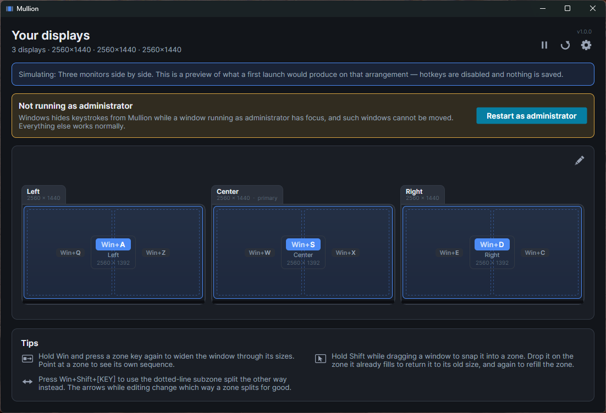
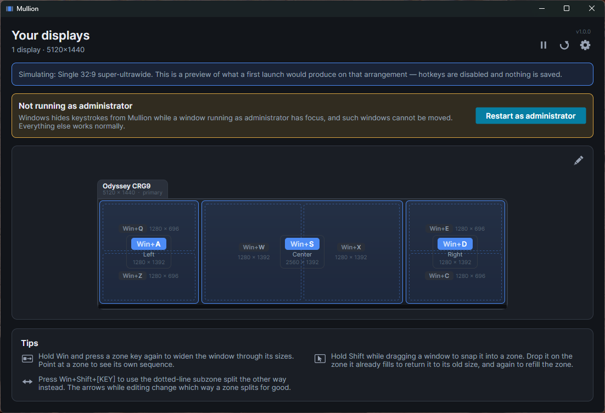
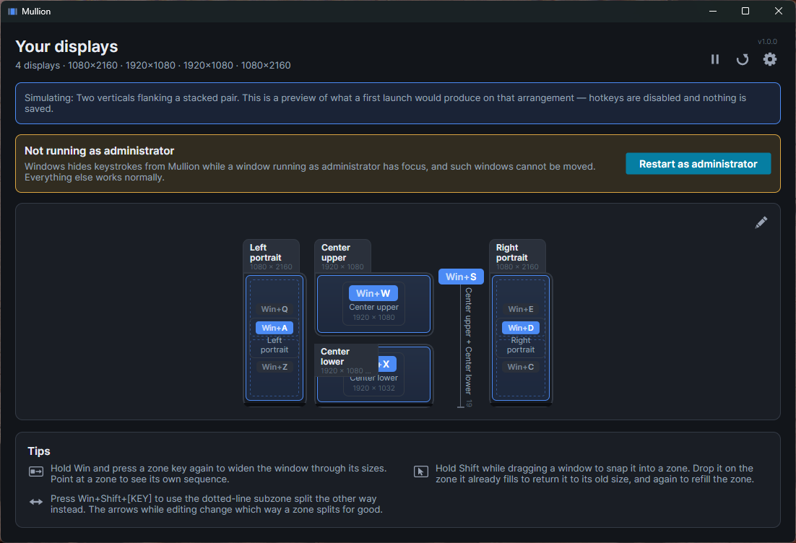
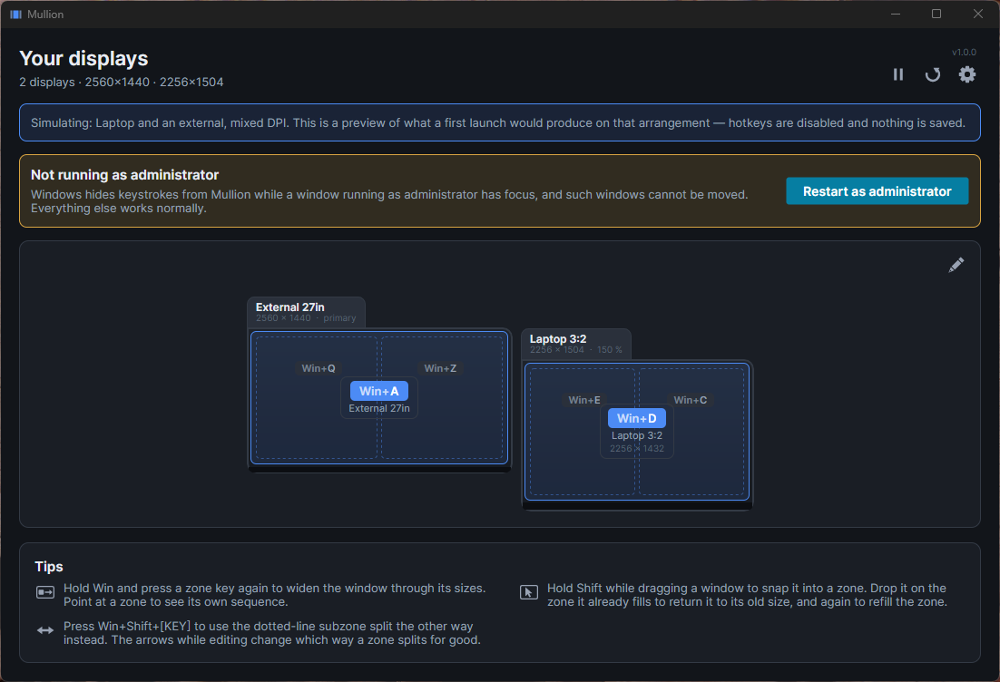

# Mullion

**Press `Win` and a key, and the focused window snaps to a zone.**

A *mullion* is the vertical bar that divides a window into panes — which is what
this does to a wide monitor. It reads your actual display arrangement, works out
a split that suits each screen's shape, and lays the zones onto the left-hand
key block so the keyboard becomes a small map of your desk. One file, no
installer, nothing to configure before it works.

[](https://github.com/levinium/Mullion/releases/latest)
[](https://github.com/levinium/Mullion/releases)
[](https://github.com/levinium/Mullion/releases/latest)
[](https://github.com/levinium/Mullion/actions/workflows/ci.yml)



## Download

**[Mullion.exe](https://github.com/levinium/Mullion/releases/latest) — 64 MB**

One self-contained executable with the .NET runtime inside it. There is nothing
to unzip and nothing to install: put it anywhere and run it. Nothing else has to
be present on the machine and nothing has to be kept in step with it.

Then turn on **Start Mullion when I sign in** in Settings. Auto-start records
wherever the exe is at that moment, so move it where you want it first and set
that afterwards.

**Windows will warn you the first time.** The build is not code-signed, so
SmartScreen shows "Windows protected your PC" — choose *More info*, then *Run
anyway*. Some antivirus engines flag it on sight too, because a keyboard hook
inside a single-file bundle has the same shape as a packed keylogger.

What separates the two is what the hook does with a keystroke, and this one
never records them: only the *name* of a chord that matched a binding is ever
written to the log. That is a rule the code is built around rather than a
promise made about it, and the source is here to check. Every release also
publishes a SHA256 beside the download.

## Why it exists

Binding `Win+A` normally requires remapping the Windows key with PowerToys
first, because `RegisterHotKey` cannot claim shell-reserved `Win` combinations.
Mullion uses a low-level keyboard hook, which sits ahead of the shell in the
input chain and can take those keys directly. No remap in the chain, and nothing
leaking into every other app.

## The keyboard is a map of your desk

The left-hand key block is already a grid, so the display arrangement is mapped
onto it position for position:

```
   Q  W  E        upper region of each column
   A  S  D        the whole of each column      <- home row
   Z  X  C        lower region of each column
```

Two properties make this workable:

- **The home row always means "the whole of this column."** Whatever else
  changes, `A`/`S`/`D` addresses the displays themselves, so the rows above and
  below are strictly additive and nothing already learned moves.
- **Nothing is hardcoded per display type.** Split counts derive from the
  long-axis ratio and a DPI-scaled pixel floor, so a 3:2 laptop or a rotated
  32:9 gets a sensible layout without having been anticipated.

On a 5120×1440 that produces:

```
  Q  1280×696    W  2560×696    E  1280×696
  A  1280×1392   S  2560×1392   D  1280×1392     <- 25 / 50 / 25, 16:9 center
  Z  1280×696    X  2560×696    C  1280×696
```



## Subzones that follow the shape

The rows above and below the home row hold each column's subzones, and which way
a zone is cut follows its shape rather than a fixed rule. A wide zone splits into
left and right halves, a tall one into upper and lower — so a 16:9 monitor in a
three-monitor row gives two windows side by side, which is what that shape is
good for, while a portrait panel still stacks.

Hold **Shift** to get the other orientation for one press, without changing
anything: `Win+Shift+Q` takes the half that `Win+Q` did not. The diagram draws
whichever half is not the default as a dotted line, so the alternative is visible
rather than remembered.

To change it for good, open the zone editor and use the arrows in a zone's
corner. That pins the axis for that zone, and pinning is an edit like any other —
it undoes, redoes, and clears with **Reset zones**.

## Cycling

Press a key again **while still holding Win** and the window widens through a
cycle — its zone, then the half of the display it sits in, then the display.
Releasing Win resets to the first step, so an accidental extra press cannot leave
a window somewhere unexpected minutes later.

```
Win held, A tapped 3x    1280 -> 2560 -> 5120 wide
Win released between     1280 each time
```

## Drag to snap

Hold **Shift** while dragging a window and the zones appear; the one under the
cursor highlights; release and the window lands in it, through the same mover the
hotkeys use. The modifier is configurable, and can be set to none to have the
zones appear on every drag.

The zones offered are the largest tiling the layout allows, not every zone. Zones
overlap on purpose — a column holds the whole of itself *and* its halves, on
different keys — which a key can disambiguate and a pointer cannot, since it sits
inside all three at once.

Windows that draw their own title bars still work. Chromium and Electron
implement a custom caption by returning `HTCAPTION` from `WM_NCHITTEST`, so the
OS runs its normal move loop and `EVENT_SYSTEM_MOVESIZESTART` fires as it does
for any other window — verified with `--drag-test` on Brave and VS Code.

**PowerToys FancyZones claims the same gesture.** Two zone managers on one drag
both move the window and whichever finishes last wins, so the result changes from
drag to drag — which looks like Mullion being unreliable rather than like a
conflict. Mullion detects this and says so, with a button to open PowerToys.

## Other keys

| Binding | Action |
|---|---|
| `Win+` `` ` `` | Minimize the focused window |
| `Win+Backspace` | Undo the last move — including a minimize, which comes back focused |

Both are defaults rather than fixtures: rebind them in Settings, or clear them.
Any key can be bound, not only the fifteen the layout happens to use — those are
where the zones *start*, not a limit on what a binding may be.

## Unusual desks

Most of the arrangements the layout engine is built for cannot be produced on one
desk, so `--simulate` swaps in a synthetic display provider and shows exactly
what a first launch would make of one:

```
dotnet run --project src/Mullion.App -- --simulate two-across
dotnet run --project src/Mullion.App -- --simulate verticals-flanking-stacked
```



Two vertical monitors flanking a stacked pair — the arrangement that defeats the
obvious algorithm, since each vertical overlaps *both* center monitors and a
naive clustering collapses all four into one row. Columns are analysed
separately, so each spends its own rows: the verticals get halves above and below
their whole, the center column gets its two monitors with `Win+S` spanning them,
and nine zones land on nine keys with nothing more than one keystroke away.

A laptop docked to an external at a different scaling is handled the same way,
from the same rule:



The presets live in `Mullion.Core/Simulation/SimulatedTopologies.cs` — a lone
32:9, a rotated one, three portraits, an L-shape, a mixed-DPI laptop and dock, a
5:4 beside a 16:9, and others.

Simulating is read-only and says so on screen: no hook is installed, nothing is
saved, the watchers stay down, and the layout is always generated fresh rather
than matched to a stored profile. The zones describe monitors that are not there,
so a live hotkey would throw a real window off-screen.

## Updates

Once a day the app asks GitHub whether a newer release exists, and says so on the
main window if one does. There is no installer and no package manager here — one
file, copied wherever you like — so without this a fix ships and the people it
was written for never find out.

It sends nothing. No identifier, no machine, no version in a query string, no
record of who asked: it is a GET for a public file, and the answer is compared
locally. This is the only network request Mullion makes unless you ask it to
install something, so turning the setting off in Settings → About makes the app
silent.

That restraint is the point rather than a detail. This app installs a low-level
keyboard hook, which is the same mechanism a keylogger uses, and from outside the
only difference is what the process sends and what it keeps.

### Installing one

Mullion can also replace itself. **Settings → About → Download update** fetches
the new release and verifies it; **Restart to finish** puts it in place and
starts it. Nothing happens without both clicks — there is no silent update, and
no moment where the app decides on its own to vanish and come back.

The two steps are separate because they fail differently. Downloading is slow and
can go wrong in a dozen ordinary ways, and abandoning it changes nothing.
Installing is two renames and a restart.

**How the swap works.** Windows will not let a running executable be overwritten,
but it will let one be *renamed* — which is the whole trick:

```
Mullion.exe      -> Mullion.exe.old     the running app, still running
Mullion.exe.new  -> Mullion.exe         the verified download takes the name
                                        start it, and exit
```

The new process deletes the backup, because it is the first thing that is able
to — Windows holds the old file until the process using it goes away. If the
second rename fails, the first is undone and the app is exactly as it was; the
window where neither file holds the real name is one rename wide and nothing is
running from disk during it. The name is preserved on purpose, because auto-start
and every shortcut anyone made record a path.

**What is checked before anything is replaced.** This is the most dangerous thing
the app does — it downloads an executable and arranges for the machine to run it
— so:

- The download is HTTPS, from the release host.
- Its SHA256 must equal the checksum published beside it. A release with no
  checksum is refused rather than installed unverified.
- If the **running** copy carries a valid signature, the replacement must carry a
  valid one from the same publisher. That does nothing while the build is
  unsigned, and becomes the real defense the day it is signed — without anyone
  having to remember to turn it on, and with no way to be downgraded to an
  unsigned file.

Be clear about what the checksum does and does not buy: it is published from the
same place as the download, so it proves the file arrived intact, not that the
release was made by someone you trust. **Signing the binary is what would make
that claim**, and until it is signed, a self-updater is only as trustworthy as
the account that publishes the releases.

Mullion will not replace itself where it cannot — a copy in `Program Files`
without administrator rights, or a build from source with its assemblies loose
beside it. Both say so and point at the releases page instead.

## Known limitations

- **Elevated windows.** Windows blocks a medium-integrity process from
  interfering with an elevated one. Mullion cannot move such a window, and its
  hook receives no key events at all while one has focus — the hotkey silently
  does nothing. Opt into elevated auto-start (a scheduled task, so no UAC prompt
  each logon) if you need to manage them.
- **Competing hooks.** Hooks are called in install order, most recent first.
  Mullion beats a tool that started at boot only because it started later; if
  that tool restarts it claims the key first. Mullion detects PowerToys Keyboard
  Manager remaps that collide and says so.
- **Tray icon visibility.** Windows 11 hides new tray icons in the overflow
  flyout by default. Drag it onto the taskbar, or enable it under Settings →
  Personalization → Taskbar → Other system tray icons.
- **Wayland.** Linux support would mean X11 only. Wayland deliberately forbids
  programmatic window positioning, so this app's core function cannot work there
  regardless of effort.
- **macOS and Linux are not implemented.** The abstractions are in place; the
  backends are not.

## Not yet built

Named layout snapshots and per-app rules. Layouts already export and import as a
file, from Settings; what that file does not carry is the general settings around
them.

Mixed-DPI drag-to-snap is unexercised. Several same-DPI monitors work — that is
where the overlay was found spilling onto the neighbouring screen, and fixed —
but the per-zone overlay also exists to handle displays at *different* scalings,
which no arrangement here can produce.

---

## Building from source

Requires the .NET 10 SDK (pinned in `global.json`).

```
dotnet build
dotnet test
dotnet run --project src/Mullion.App
```

To produce the single-file executable:

```
.\tools\Publish.ps1
```

The publish runs the tests and refuses to produce an exe if any fail. A hotkey
tool that is broken is worse than one that is absent: it swallows keystrokes on
their way to whatever you actually wanted.

Not trimmed, deliberately. Avalonia resolves controls, converters and styles by
name at runtime, so a trimmer that cannot see those uses removes them — and the
failure is a blank window at launch rather than a build error.

### Layout

```
src/Mullion.Core/               no OS calls; all the layout maths and hotkey matching
src/Mullion.Platform.Windows/   every P/Invoke, and nothing else
src/Mullion.App/                Avalonia UI, tray, wizard
tools/Mullion.Probe/            diagnostic CLI
tests/Mullion.Core.Tests/       the layout and hotkey maths, run on any OS
tests/Mullion.App.Tests/        the UI, headless
```

`Mullion.Core` references no Windows or Avalonia assemblies. That boundary is
what keeps the layout maths testable without hardware and makes a macOS backend a
self-contained job rather than a rewrite.

### The probe

`tools/Mullion.Probe` exercises the engine without any UI in the way, which is
how most of it was verified:

```
mullion-probe                        detected displays and the derived layout
mullion-probe --self-test            drive a real window through every zone
mullion-probe --hotkey-test          install the hook and verify Win+key end to end
mullion-probe --cycle-test           verify repeat-press cycling and reset-on-release
mullion-probe --watch-displays       log display-change messages as they arrive
mullion-probe --inject Q             inject Win+Q at an already-running Mullion
mullion-probe --snap S --delay 3     snap the foreground window
mullion-probe --undo                 restore the last move
mullion-probe --drag-test            log which apps report a drag, and the zone under the cursor
mullion-probe --rebind-survives      verify a rebind outlives the next layout rebuild
```

### Screenshots and the icon

`tools/Capture-Simulations.ps1` screenshots the main window once per simulated
arrangement, which is how the defaults get reviewed side by side and where the
images in this README come from.

`tools/icon/Build-Icon.ps1` regenerates `mullion.ico` and, with `-Mockup`, a
contact sheet of every candidate at every size on light and dark backgrounds.
16px is where icons fail, so they are judged there rather than by scaling a large
one down.

### Forking

Two build properties exist so a fork does not inherit anything personal.

The support button has **no** default, so a build from a clean checkout has no
donate button at all — nothing to strip out, and nothing to remember to remove:

```
.\tools\Publish.ps1 -SponsorUrl "https://github.com/sponsors/<user>"
```

The update feed **does** have one, because the two fail in opposite directions: a
donate link left in by accident asks strangers for money, while an update feed
left out is simply never mentioned again. Point it at your own releases, or pass
an empty string to build a version that never checks:

```
.\tools\Publish.ps1 -UpdateFeedUrl "https://api.github.com/repos/<you>/<repo>/releases/latest" `
                    -UpdatePageUrl "https://github.com/<you>/<repo>/releases/latest"

.\tools\Publish.ps1 -UpdateFeedUrl ""
```

## License

MIT — see [LICENSE](LICENSE).
